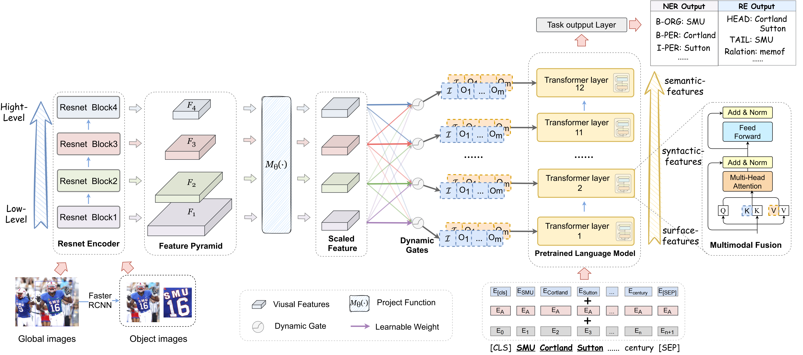

# HVPNet

Code for the NAACL2022 paper "[Good Visual Guidance Makes A Better Extractor: Hierarchical Visual Prefix for Multimodal Entity and Relation Extraction]()".

Model Architecture
==========
<div align=center>

</div>
The overall architecture of our hierarchical modality fusion network.


Requirements
==========
To run the codes, you need to install the requirements:
```
pip install -r requirements.txt
```

Data Collection
==========
The datasets that we used in our experiments are as follows:


+ Twitter2015 & Twitter2017
    
    The text data follows the conll format. You can download the Twitter2015 data via this [link](https://drive.google.com/file/d/1LrTX2fVj6emcguwm5NUSRBiMjQRSKq4_/view?usp=sharing) and download the Twitter2017 data via this [link](https://drive.google.com/file/d/1ogfbn-XEYtk9GpUECq1-IwzINnhKGJqy/view?usp=sharing). Please place them in `data/NER_data`.

    You can also put them anywhere and modify the path configuration in `run.py`

+ MNER
    
    The MRE dataset comes from [MEGA](https://github.com/thecharm/MNRE) and you can download the MRE dataset with detected visual objects using folloing    
    command:
    ```bash
    cd data
    wget 120.27.214.45/Data/re/multimodal/data.tar.gz
    tar -xzvf data.tar.gz
    mv data RE_data
    ```


Data Preprocess
==========
To extract visual object images, we first use the NLTK parser to extract noun phrases from the text and apply the [visual grouding toolkit](https://github.com/zyang-ur/onestage_grounding) to detect objects. The detected objects are available in our data links.


The expected structure of files is:


```
HMNeT
 |-- data	# conll2003, mit-movie, mit-restaurant and atis
 |    |-- NER_data
 |    |    |-- twitter2015  # text data
 |    |    |    |-- train.txt
 |    |    |    |-- valid.txt
 |    |    |    |-- test.txt
 |    |    |    |-- twitter2015_train_dict.pth  # {full-image-[object-image]}
 |    |    |    |-- ...
 |    |    |-- twitter2015_images       # full image data
 |    |    |-- twitter2015_aux_images   # object image data
 |    |    |-- twitter2017
 |    |    |-- twitter2017_images
 |    |-- RE_data
 |    |    |-- ...
 |-- models	# models
 |    |-- bert_model.py
 |    |-- modeling_bert.py
 |-- modules
 |    |-- metrics.py    # metric
 |    |-- train.py  # trainer
 |-- processor
 |    |-- dataset.py    # processor, dataset
 |-- logs     # code logs
 |-- run.py   # main 
 |-- run_ner_task.sh
 |-- run_re_task.sh
```

Train
==========

## NER Task

The data path and GPU related configuration are in the `run.py`. To train ner model, run this script.

```shell
bash run_twitter15.sh
bash run_twitter17.sh
```

checkpoints can be download via [Twitter15_ckpt](), [Twitter17_ckpt](https://drive.google.com/file/d/1sgsjx_JVMYfu-_95e_3hB8tTR-NUiD27/view?usp=sharing).

## RE Task

To train re model, run this script.

```shell
bash run_re_task.sh
```
checkpoints can be download via [re_ckpt](https://drive.google.com/file/d/1x-yPYy8pjhsDzhhLLzLzEjyVFeQ063HM/view?usp=sharing)

Acknowledgement
==========

The acquisition of Twitter15 and Twitter17 data refer to the code from [UMT](https://github.com/jefferyYu/UMT/), many thanks.

The acquisition of MNRE data for multimodal relation extraction task refer to the code from [MEGA](https://github.com/thecharm/Mega), many thanks.

Papers for the Project & How to Cite
==========


If you use or extend our work, please cite the paper as follows:
```

```
